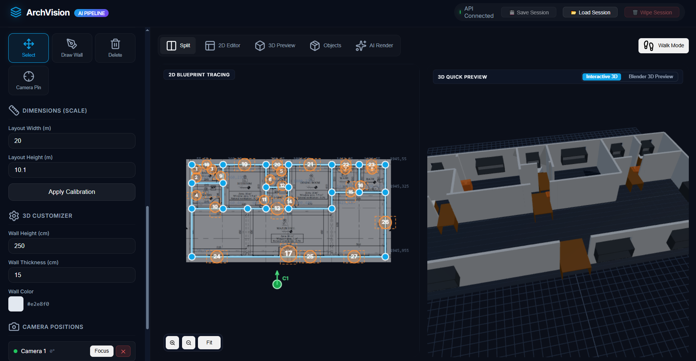
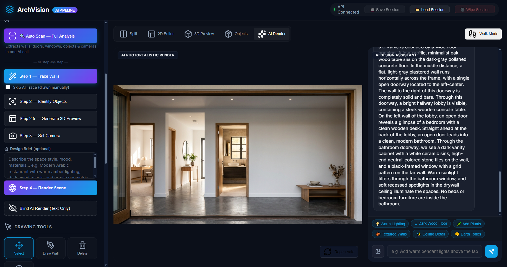

# floorplan-to-fitout

Convert a 2D architectural floor plan into a photorealistic interior render using AI.

Upload a floor plan blueprint → AI traces walls, identifies objects, places cameras → generates a photorealistic 3D render.




---

## What It Does

1. **Auto Scan** — Upload a floor plan image. One AI call extracts walls, doors, windows, furniture, rooms, and suggests camera positions.
2. **3D Preview** — Live Three.js viewport renders the extracted layout in 3D with wall openings for doors and windows.
3. **Manual Editing** — Draw, move, or delete walls manually. Place or adjust objects. Position cameras.
4. **Blind AI Render** — No Blender needed. AI reads the 2D plan + 3D viewport and generates a photorealistic interior image.
5. **Blender Render** — Full Blender pipeline for high-fidelity renders (requires Blender installed on server).

---

## Stack

| Layer | Tech |
|---|---|
| Frontend | Vanilla HTML/CSS/JS + Three.js |
| Backend | Node.js + Express |
| AI Vision | Google Antigravity CLI (`agy`) |
| 3D Render | Blender (optional) |
| Image Gen | Google Imagen via AGY |

---

## Project Structure

```
floorplan-to-fitout/
├── backend/
│   ├── server.js          # Express API (trace, identify, auto-scan, render routes)
│   ├── blender_scene.py   # Blender Python script for 3D scene generation
│   └── package.json
├── cad/
│   ├── index.html         # Main app UI
│   ├── index.js           # Frontend logic (Three.js, AI pipeline, canvas editor)
│   └── index.css          # Styles
└── .gitignore
```

---

## API Routes

| Method | Route | Description |
|---|---|---|
| `POST` | `/trace` | AI wall tracing from floor plan image |
| `POST` | `/identify` | AI furniture/fixture identification |
| `POST` | `/auto-scan` | Unified: walls + doors + windows + objects + cameras in one call |
| `POST` | `/blind-render/stage1` | AI vision pass on 2D plan |
| `POST` | `/blind-render/stage2` | AI refinement pass with 3D viewport |
| `POST` | `/blind-render/stage3` | Image generation |
| `POST` | `/blender-render` | Full Blender render pipeline |
| `POST` | `/chat` | AI design assistant chat |

---

## Setup

```bash
# Install backend dependencies
cd backend
npm install

# Start the backend
node server.js
```

The frontend (`cad/`) is served as static files. Point your web server or reverse proxy at `cad/index.html`.

The backend runs on port `3014` by default.

---

## Requirements

- Node.js 18+
- Python 3 + Pillow (`pip install Pillow`)
- [Antigravity CLI](https://antigravity.dev) (`agy`) — for AI vision and image generation
- Blender 3.x+ (optional, only for `/blender-render`)

---

## License

Source-Available (All Rights Reserved) — Copyright (c) 2026 Ahmed Xuhri.

This repository is source-available for viewing, educational, and evaluation purposes only. Commercial use, public redistribution, SaaS hosting, or creation of derivative works without prior written consent is strictly prohibited. See [LICENSE](LICENSE) for full terms.
